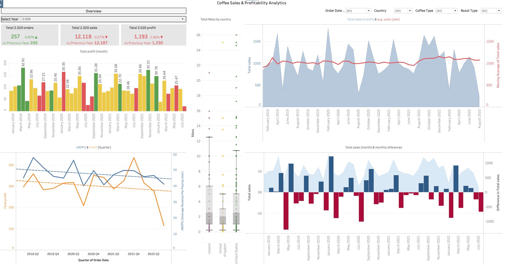

**Coffee Sales & Profitability Analysis: Global Performance & KPI Evaluation**

**Project Overview** 
This project focuses on tracking global sales performance, monitoring profitability margins, and analyzing customer purchasing behavior across a multi-year dataset. The goal is to provide stakeholders with deep insights into regional sales distribution, volatility trends, and high-value customer segments.

The analysis is conducted using an integrated BI and data workflow: 
**MS Excel** for foundational data preparation, 
**Tableau Public** for dynamic modeling and interactive executive dashboards, and advanced calculated logic for business metrics.

**Dataset Description** 
The analysis is based on transaction records containing order details, revenue, profit, and customer behavior metrics:
* **Order Date / Year**: Temporal dimensions spanning from January 2019 to August 2022.
* **Sales & Profit**: Financial metrics tracking monetary value and net earnings.
* **Geographic & Product Attributes**: Data segmented by country, coffee type, and roast type.

**Tech Stack & Methodology**
* **MS Excel:** Utilized for initial data structuring, cleaning, and preliminary data aggregation.
* **Tableau Public / Desktop:** Built advanced calculated fields and user-driven parameters for dynamic YoY (Year-over-Year) comparisons, ARPPU (Average Revenue Per Paying User), and profit margins. Designed interactive UI components, including custom KPI cards with conditional formatting.
* **Advanced Visualizations:** Implemented **Box-and-whisker plots** for statistical order-weight distribution analysis and **Dual-axis charts** for trend correlation.

**Key Findings & Insights**
1. **Financial Performance:** Dynamic YoY metrics successfully tracked annual growth shifts in orders, sales, and total profit against previous periods.
2. **Customer & Product Segmentation:** Identified core regional clusters and top-performing product categories driving the highest profit margins.
3. **Trend Volatility:** Moving averages and monthly difference tracking highlighted seasonal peaks and underperforming business periods.

**Recommendation** 
Based on the implementation of a self-service BI framework and real-time interactive parameter controls, **it is recommended to adopt this dynamic KPI monitoring model for ongoing executive reporting and data-driven decision-making.**

[Link to my Tableau Public Dashboard](https://public.tableau.com/views/CoffeeSalesProfitabilityAnalitics/CoffeeSalesProfitabilityAnalytics?:language=en-US&:sid=&:redirect=auth&:display_count=n&:origin=viz_share_link)

